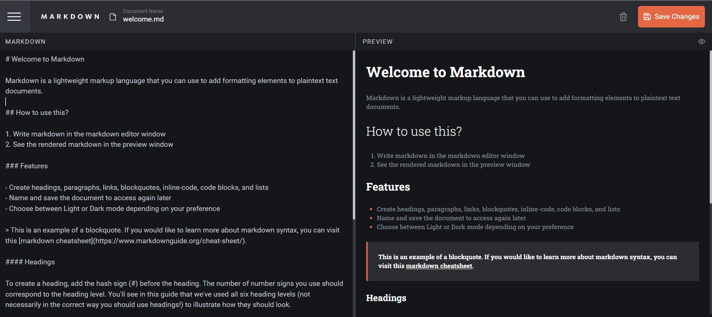
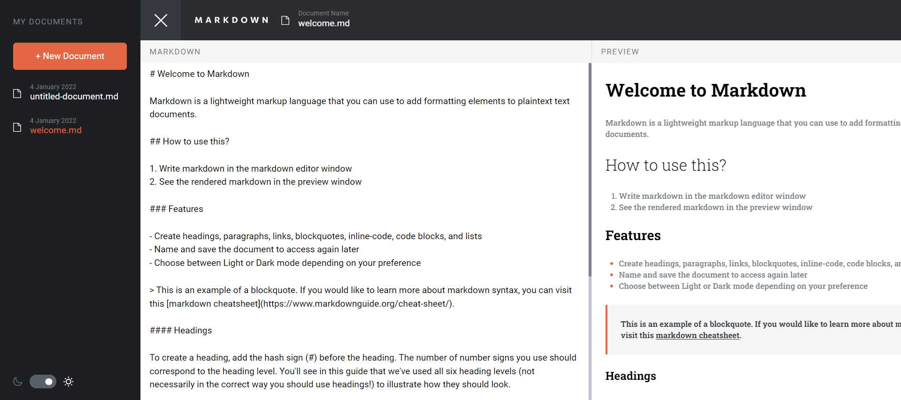

Markdown Editor (Amalitech Technical Training Project)
- A simple Markdown Editor built using React, TypeScript, and Tailwind CSS. 

- [Overview](#overview)
  - [The Requirements](#the-requirement)
  - [Built with](#built-with)
  - [Links](#links)
  - [Screenshot](#screenshot)

## Overview
This Markdown Editor is a web application that allows users to create, edit, and preview Markdown documents. It provides a user-friendly interface with features like document management, real-time preview, and a dark theme.

### The Requirements

Your users should be able to:
-  Create, Read, Update, and Delete markdown documents
-  Name and save documents to be accessed as needed
-  Edit the markdown of a document and see the formatted preview of the content
-  View a full-page preview of the formatted content
-  View the optimal layout for the app depending on their device's screen size
-  See hover states for all interactive elements on the page
-  Bonus: If you're building a purely front-end project, use localStorage to save the current
state in the browser that persists when the browser is refreshed
-  Bonus: Build this project as a full-stack application

### Built with

- [React](https://reactjs.org/)
- [TypeScript](https://www.typescriptlang.org/)
- [Vite](https://vitejs.dev/)
- [TailwindCSS](https://tailwindcss.com/)
- [Zustand](https://github.com/pmndrs/zustand)
- [React-toastify](https://fkhadra.github.io/react-toastify/)
- [React-markdown](https://github.com/remarkjs/react-markdown)
-

### Links

- Live Site URL: [https://https://inbrowser-markdown.vercel.app/](https://inbrowser-markdown.vercel.app//)

### Screenshot

Contributing
Contributions are welcome! Please follow the Development section for guidelines on how to contribute.

License
This project is licensed under the MIT License.

Acknowledgments
React
TypeScript
Tailwind CSS

